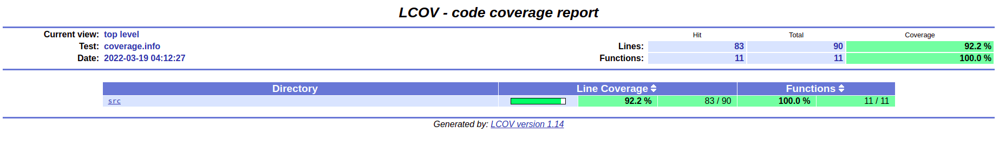

# Домашнее задание 1 по курсу "Углубленное программирование на языке С/С++ (web)"
# Магомедов Зайнутдин WEB-11
# Вариант 9
Создать структуру для хранения информации о составе рациона питания: энергетической ценности, содержании белков, жиров, углеводов, наличии пищевых добавок, витаминов и минералов. Составить с ее использованием программу подбора завтрака по заданным пользователем критериям: калорийности, предельному содержанию жиров, наличию определенных добавок и пр.
# Отчет о покрытии кода юнит-тестами (Codecov)
